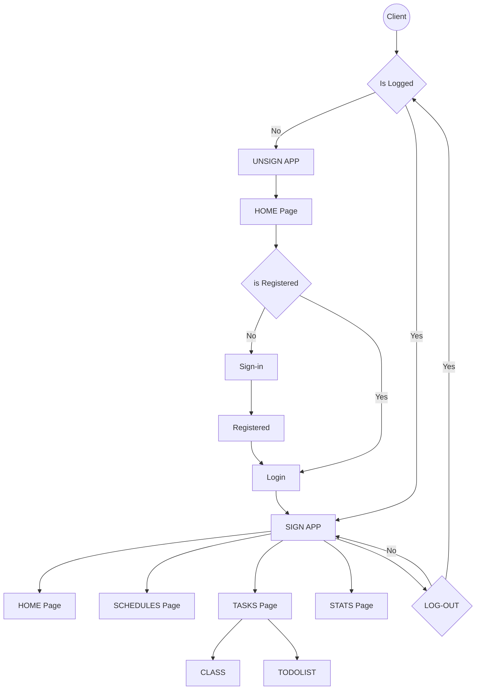

```mermaid
flowchart TD
A((Client))
A-->Log{Is Logged}

Log-->|No| un-app[UNSIGN APP]
un-app-->C[HOME Page]
C-->Reg{is Registered}

Reg-->|No| D[Sign-in] --> E[Registered] --> Login
Reg-->|Yes| Login -->app

Log-->|Yes| app[SIGN APP]
app-->home[HOME Page]
app-->schedules[SCHEDULES Page]
app-->tasks[TASKS Page]
tasks-->clas[CLASS]
tasks-->todo[TODOLIST]
app-->stats[STATS Page]

app-->logout{LOG-OUT}
logout-->|No| app
logout-->|Yes| Log
```